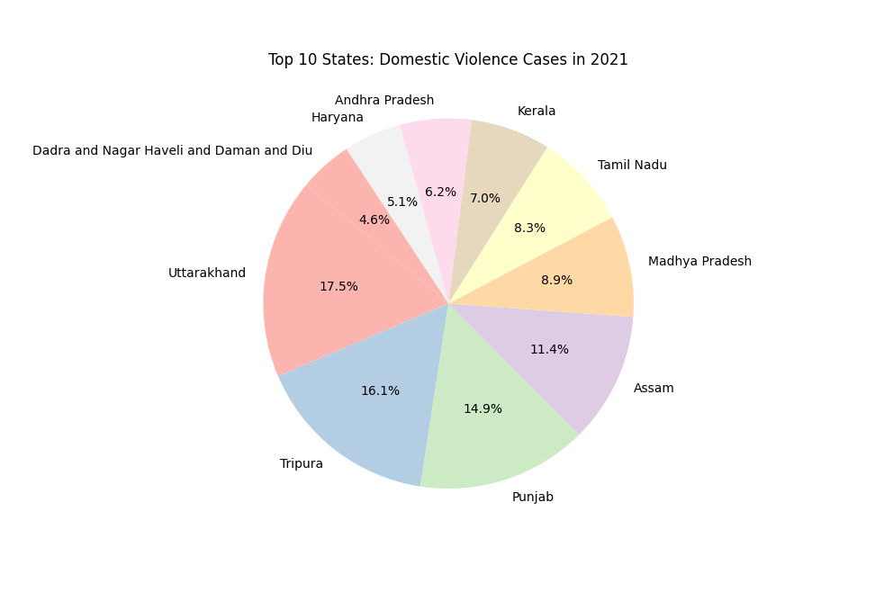

# Domestic Violence Visualization (2021)

This project presents a data visualization of reported domestic violence indicators across the top 10 countries in 2021.

The goal of this exercise was to explore cross-country differences in social safety indicators using publicly available datasets and practice communicating sensitive social data visually.

## Visualization

## Tools Used
- Python
- pandas

## Notes
This is an exploratory visualization created for a data journalism portfolio. The selection of countries reflects available comparable data rather than a definitive ranking of global prevalence.
